How to Use FDSNWS to Download Ground Motion Data and Metadata
===============================================

### Introduction
**FDSNWS** (Federation of Digital Seismograph Networks Web Services) is a set of web services that allow users to access and retrieve seismic data from various seismological networks and data centers. This documentation will guide you through the process of using FDSNWS to download ground motion data and its metadeta from the UPRI EarthquakeHub Network. Understanding the distinction among these two is essential to make interpretations more significant. In the context of FDSNWS,

**Data:** This is the actual seismic information you're interested in, like the earthquake measurements, shaking patterns, and seismograph readings.

**Metadata:** This provides important details *about* the data. It includes information such as when and where the seismic event occurred, how strong it was, and the equipment used to record the data. Think of metadata as helpful labels that give you context and understanding about the seismic data you're looking at.

### Service Overview

FDSNWS provides various services for accessing different types of data.
The most commonly used service for ground motion data is the ```dataselect```
service. While the ```event``` service is used to obtain the metadata

#### DataSelect
This service  allows you to retrieve time series data from seismological instruments. In the context of seismology, time series data refers to recordings of ground motion or seismic activity ***over time.***

Here are the following data you can gather from ```dataselect``` service

1. ***Seismic Waves:*** From the dataselect service, you can fetch actual data about the movement of the Earth's surface during events like earthquakes. Think of this as a detailed record of how the ground shakes during such events.

2. ***Time Charts:*** You can request time charts that show you how this shaking changes over time. These charts help scientists and researchers analyze and study the seismic activity.

3. ***Instrument Info:*** This service can also provide information about the tools (instruments) used to capture this seismic data. Understanding these instruments is crucial for correctly interpreting and using the data.


    More information about DataSelect service [here](https://www.fdsn.org/webservices/fdsnws-dataselect-1.1.pdf)

#### Event
This service is designed to provide access to information about seismic events.

Here are the following data you can gather from the ```event``` service
1. ***Earthquake Information:*** The event service gives you details about specific seismic events, particularly earthquakes. This includes where they happened, how strong they were, and when they occurred.

2. ***Event Background:*** You can access additional information about the event's source, which helps in understanding what caused the event, whether it was a natural earthquake or something else.

3. ***Station Details:*** This service also offers information about the stations that recorded data for a specific event. This helps in verifying the data's reliability and its sources.

    More information about Event service [here](https://www.fdsn.org/webservices/fdsnws-event-1.2.pdf)

### Obtaining the Data
#### Steps to Download Ground Motion Data

To obtain the Ground Motion Data, we will be using the ```dataselect``` service.


1. Access the [UPRI Earthquake Hub SeisComP FDSNWS Web Service](https://earthquake.science.upd.edu.ph/fdsnws/)

2. Choose the ```dataselect/``` web service
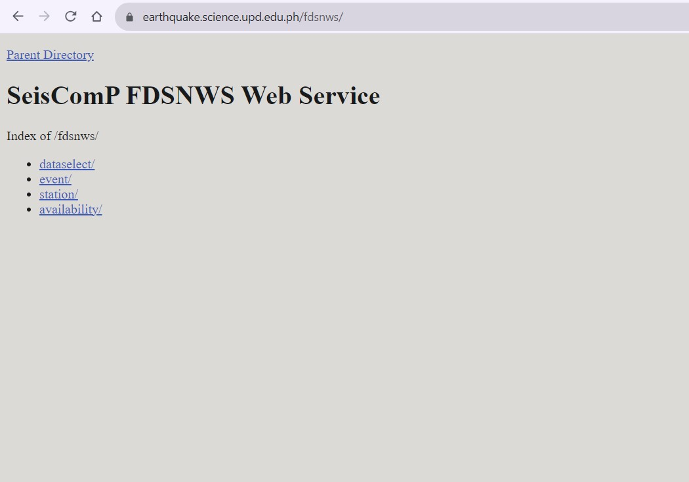


3. Proceed by choosing ```1/```
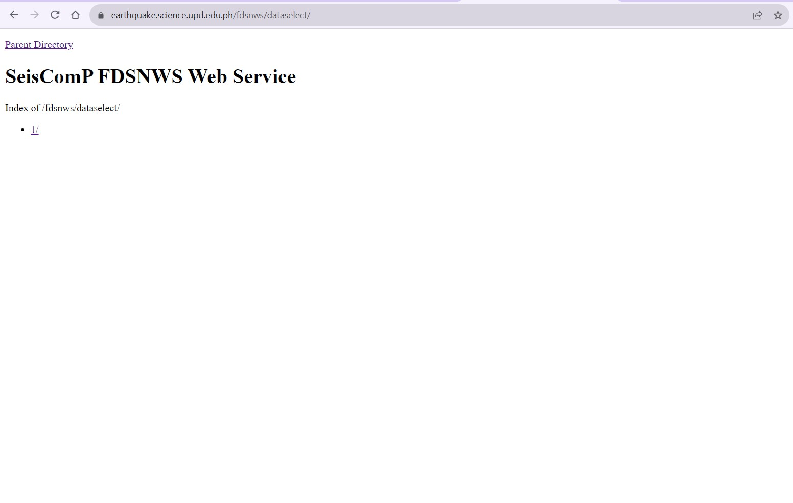

4. Under available URLs, select ```builder``` from the options to proceed to the URL Builder where you will input your information request.
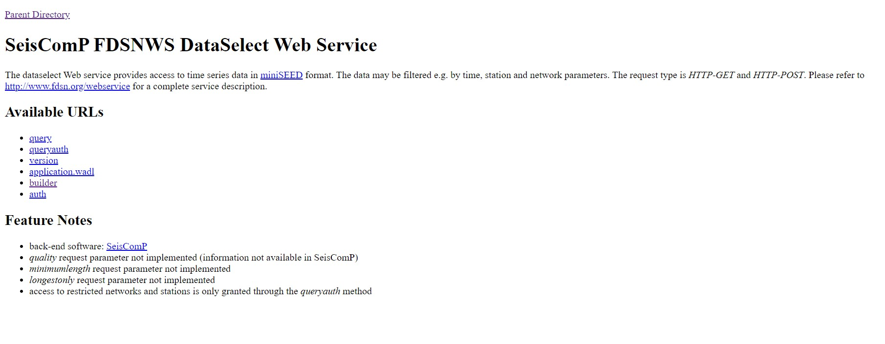
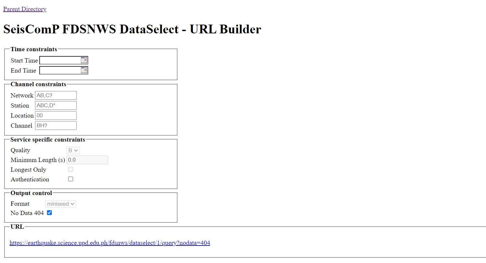

5. Specify the parameters of the data you want to download.
  This includes:

    - **Network and Station Information:**

        - ```network```: Specifies the network code, which represents the seismological network you want data from.
        - ```station```: Defines the station code, which identifies a specific seismic station.
        - ```location```: Specifies the location code, typically a two-character code representing the location of the instrument at the station.
      - ```channel```: Specifies the channel code, which identifies a specific data channel (e.g., "BHZ" for a broadband horizontal component).

    - **Time Window:**

        - ```starttime```: Specifies the beginning time of the data you want to retrieve
        - ```endtime```: Specifies the end time of the data you want to retrieve

        > **_NOTE:_** The time is formatted **YYYY-MM-DDTHH-MM-SS**. The date and time are separated by the "T". The time is in 24-Hour (military time format).

        > For example, we want to obtain the data starting from  ```October 11, 2023 at 11:30``` pm till ```October 12, 2023 11:30 am``` start time should be ```2023-10-11T23:30:00``` and end time should be ```2023-10-12T11:30:00```

    - **Data Format:**
        - ```format```: Specifies the format in which you want to receive the data. The ground data is in **miniseed** format

    - **Data Availability and Quality**:
        - ```availability```: Allows you to filter data based on its availability (e.g., "available," "not available," "all").
        - ```quality```: Filters data based on its quality (e.g., "D," "M," "Q," "R").

    - **Data Limit:**
        -  ```limit```: Sets the maximum number of data segments to return in the search results. This parameter is useful for limiting the amount of data you receive in a single request.
    - Time Correction:
        - ```updatedAfter```: Specifies the last time the data was updated. It allows you to request data that has been updated or added after a certain timestamp.

    Refer [here](https://www.fdsn.org/webservices/fdsnws-dataselect-1.1.pdf) for the query guide.

    > Example: The following parameters of our test network are the following:

        - Network: AM
        - Station: R3B2D
        - Location: 00
        - Channel: EHZ

    The values vary according the the network you want to extract data from.

    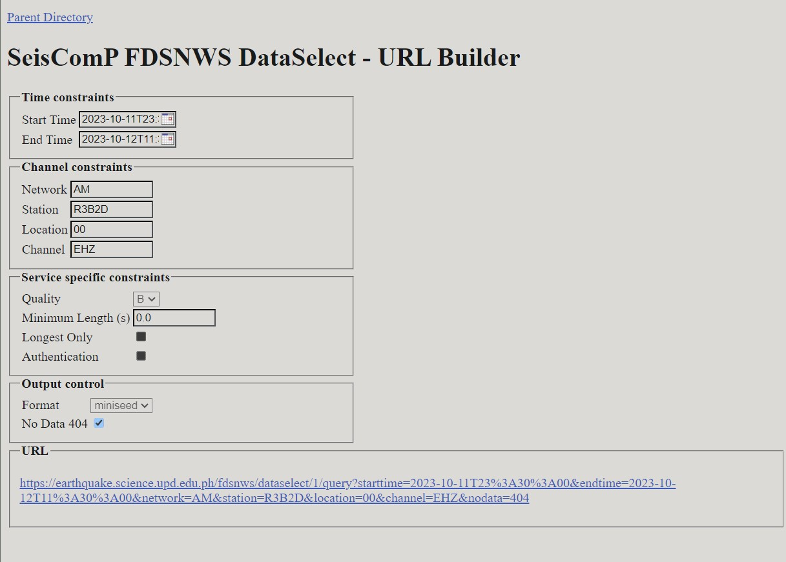

6. After filling out the form, click the link to start downloading data through clicking the URL located at the bottom part of the page.
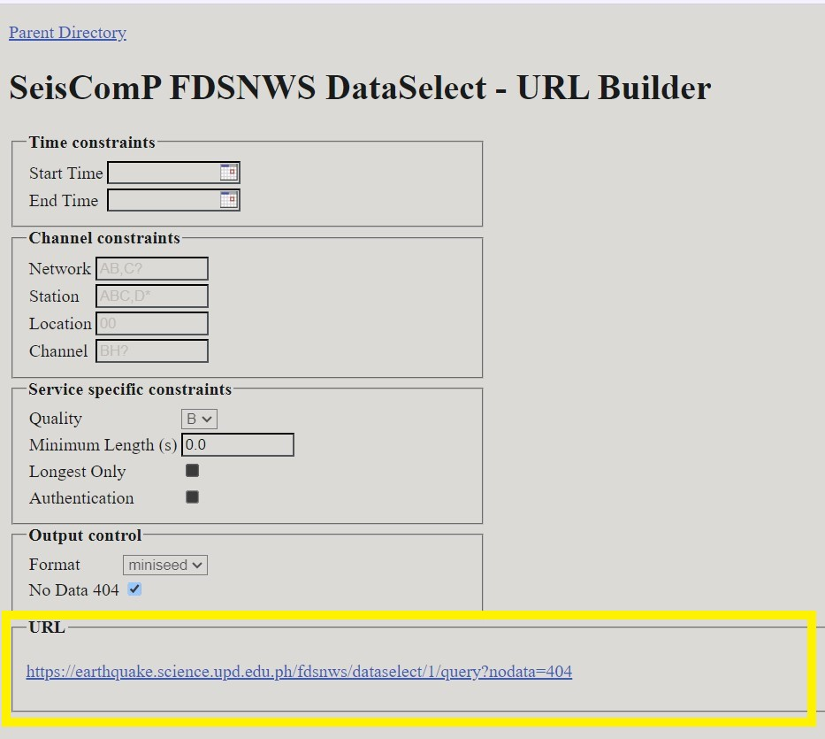


#### Steps to Download Metadata

To obtain the Metadata, we will be using the ```event``` service.

1. Access the [UPRI Earthquake Hub SeisComP FDSNWS Web Service](https://earthquake.science.upd.edu.ph/fdsnws/)
2. Choose the ```event/``` web service
3. Proceed by choosing ```1/```
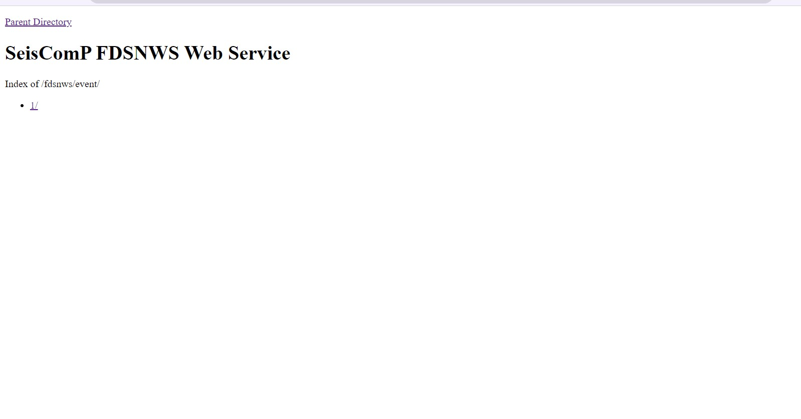

4. Under available URLs, select ```builder``` from the options to proceed to the URL Builder where you will input your information request.
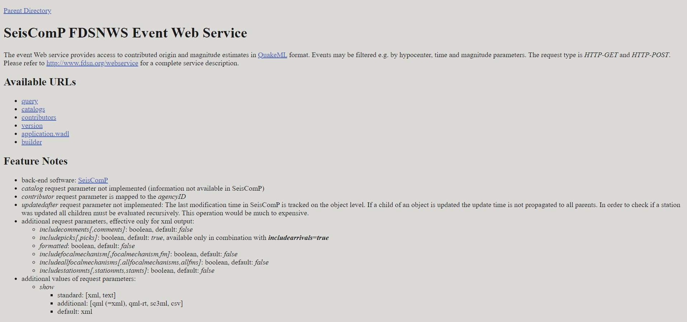

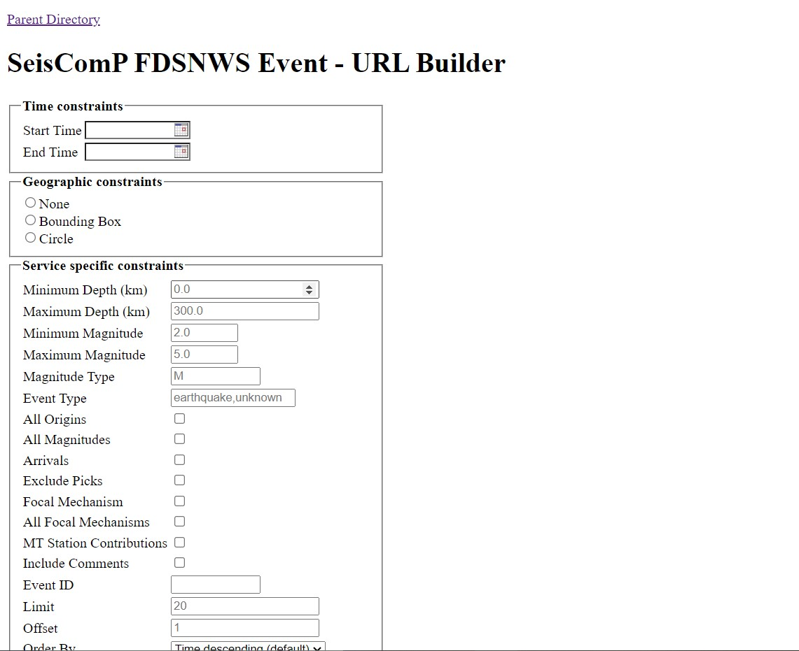


5. Specify the parameters of the data you want to download.
This includes:

    - **Start Time and End Time**:

        - ```starttime```:Specifies the beginning time for the search
        - ```endtime```: Specifies the end time for the search

        > **_NOTE:_** Refer to the instructions above regarding time formatting.

    - Geographical Region:

        - ```minlatitude```: Defines the minimum latitude (southern boundary) for the search area.
        - ```maxlatitude```: Defines the maximum latitude (northern boundary) for the search area.
        - ```minlongitude```: Specifies the minimum longitude (western boundary) for the search area.
        - ```maxlongitude```: Specifies the maximum longitude (eastern boundary) for the search area.

    - Magnitude Range:

        - ```minmagnitude```: Sets the minimum magnitude of the seismic events you want to retrieve.
        - ```maxmagnitude```: Sets the maximum magnitude of the seismic events you want to retrieve.

    - Event Depth Range:

        - ```mindepth```: Specifies the minimum depth of the seismic events you want to retrieve.
        - ```maxdepth```: Specifies the maximum depth of the seismic events you want to retrieve.

    - Event Type:

        - ```type```: Specifies the type of seismic events you're interested in, e.g., "earthquake," "explosion," "nuclear explosion," etc.

    - Event ID:

        - ```eventid```: Allows you to specify the unique identifier for a particular event.

    - Catalog and Contributor:

        - ```catalog```: Filters events based on the catalog they are part of.
        - ```contributor```: Filters events based on the organization or entity that contributed the data.

    - Event Limit:

        - ```limit```: Sets the maximum number of events to return in the search results.

    Refer [here](https://www.fdsn.org/webservices/fdsnws-event-1.2.pdf) for the query guide


6. After filling out the form, click the link to start downloading data through clicking the URL located at the bottom part of the page.

    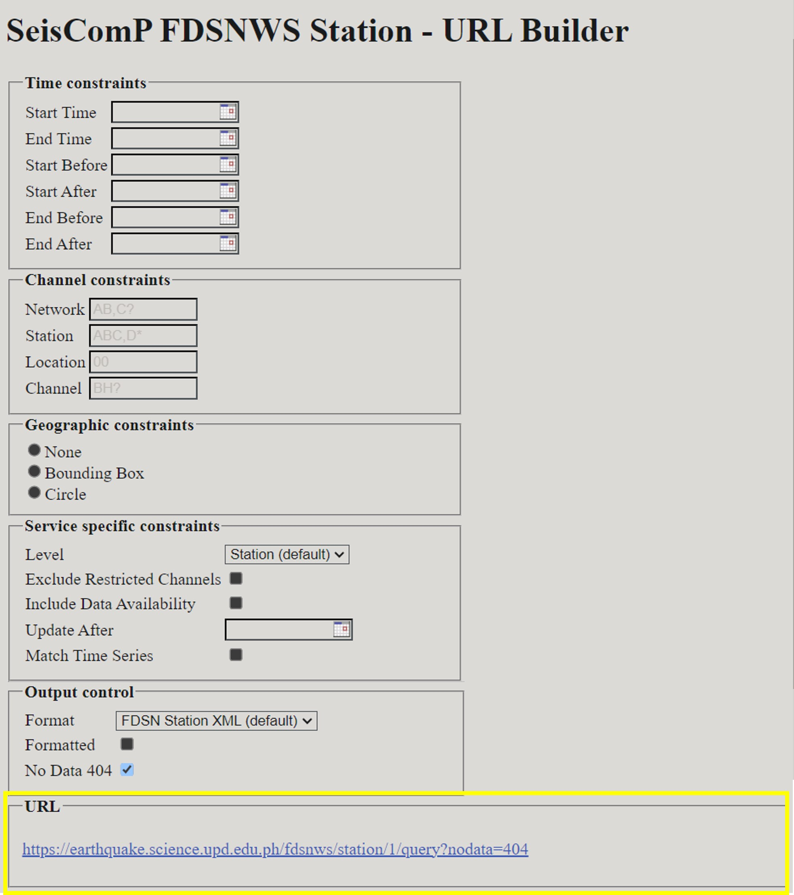


### Processing the Data

#### From DataSelect Service:

To use fetched seismic data for plotting or analysis, you can use ObsPy.
 Follow these steps:

1. **Install ObsPy:** Make sure ObsPy is installed:

```
pip install obspy
```
2. **Import the necessary modules:**

Create a Python file. You need to write a script that imports ObsPy modules for data processing and plotting:

```
from obspy import read
import matplotlib.pyplot as plt
```

3. **Load your seismic data**

You can use the obspy.read() function to load your existing seismic data file. ObsPy can read various formats, such as MiniSEED, SAC, and more. Here's an example of how to load a MiniSEED file:

```
st = read('your_seismic_data.mseed')
```

Replace 'your_seismic_data.mseed' with your actual file name.

> Example: From the retrieved data from date range ```2023-10-11T23:30:00``` and ```2023-10-15T11:30:00```, I've downloaded the MiniSeed data with the file name ```fdsnws.md```

```
st = read('fdsnws.mseed')
```

4. **Plot the time series:**

You can use ObsPy to plot the loaded time series data using Matplotlib. Here's an example:

```
st.plot(type="dayplot", title="Seismic Data", vertical_scaling_range=2000, color="black", size=(800, 600))
plt.show()
```

The type="dayplot" argument specifies the type of plot you want to create. You can adjust the other parameters as needed, such as title, scaling range, color, and figure size.

More plot features accessible [here](https://docs.obspy.org/packages/autogen/obspy.core.stream.Stream.plot.html)

For windows, press CTRL + B to run your python code

If your code ran successfully, a MatLab window containing your visualized miniSEED data will appear.

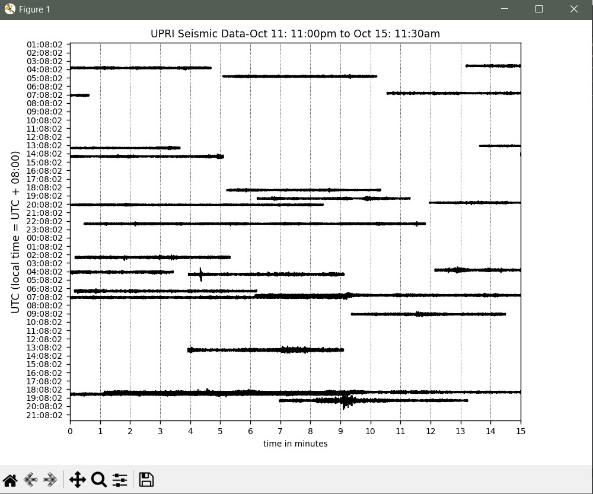


5. **Save the plot file**

Click the save icon below the plot


Congratulations! You now have a plot of the Seismic Data you just downloaded from FDSNWS!

#### From Event Service

1. :
-Print Information from the metadata (obspy)
do the same from following the documentation
