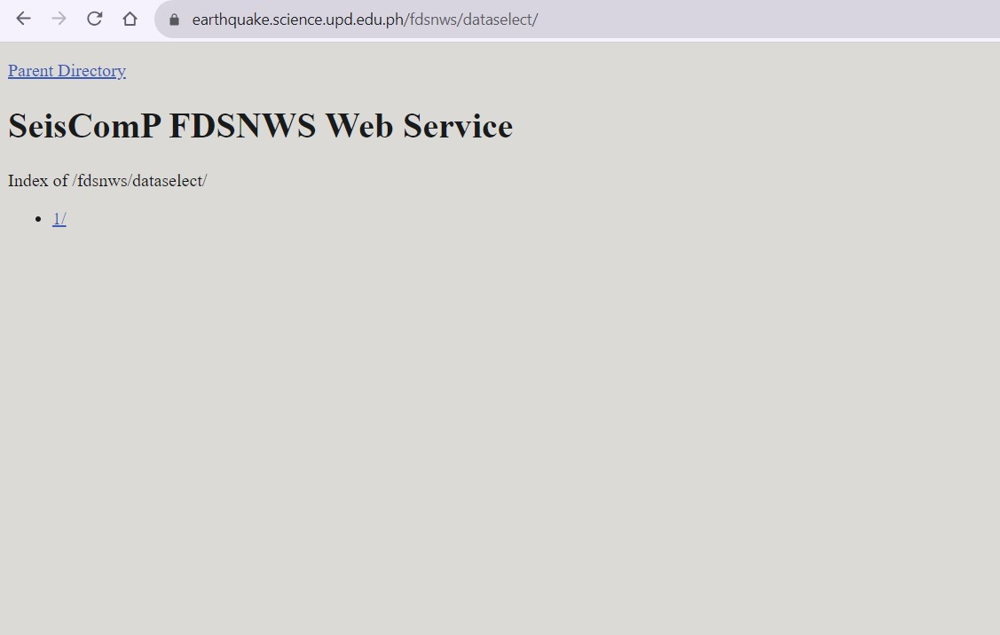
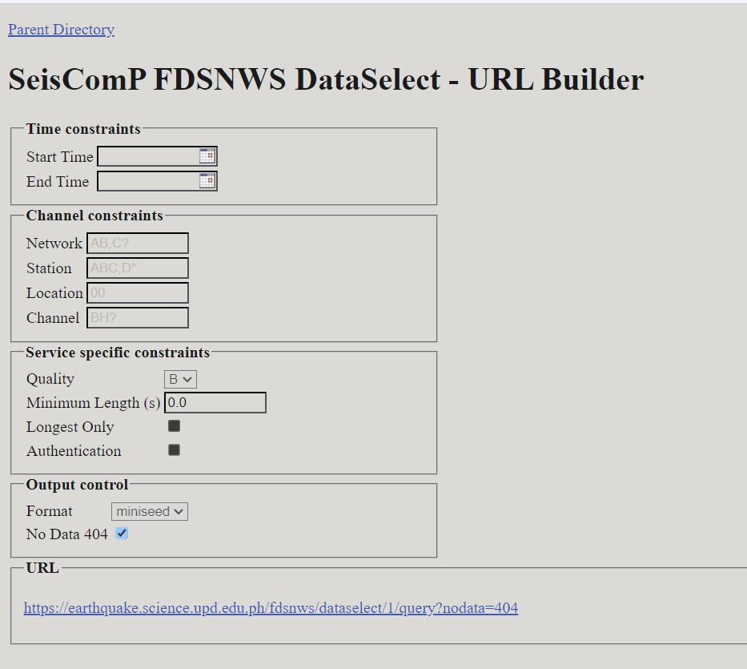
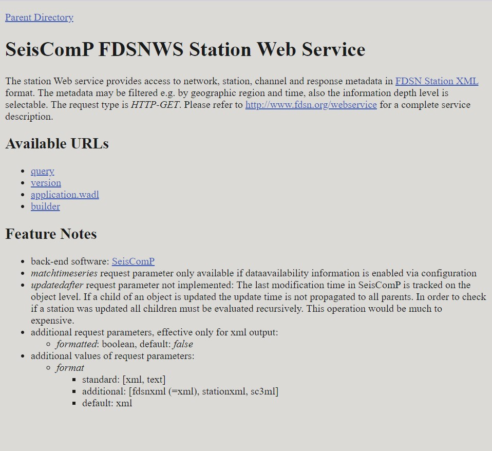
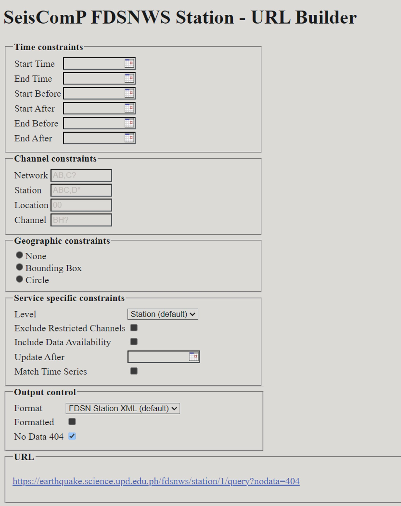
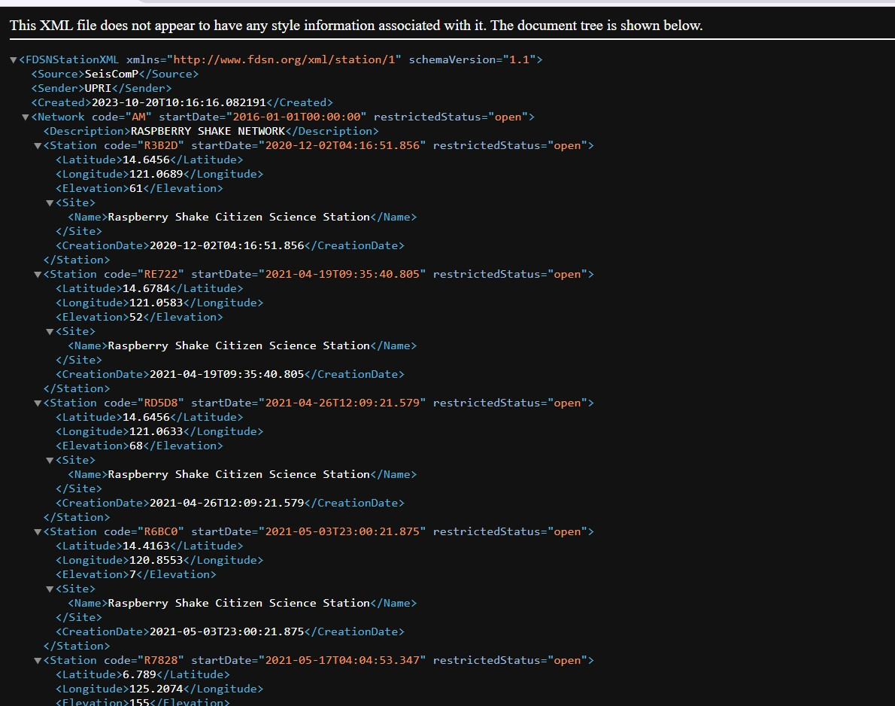
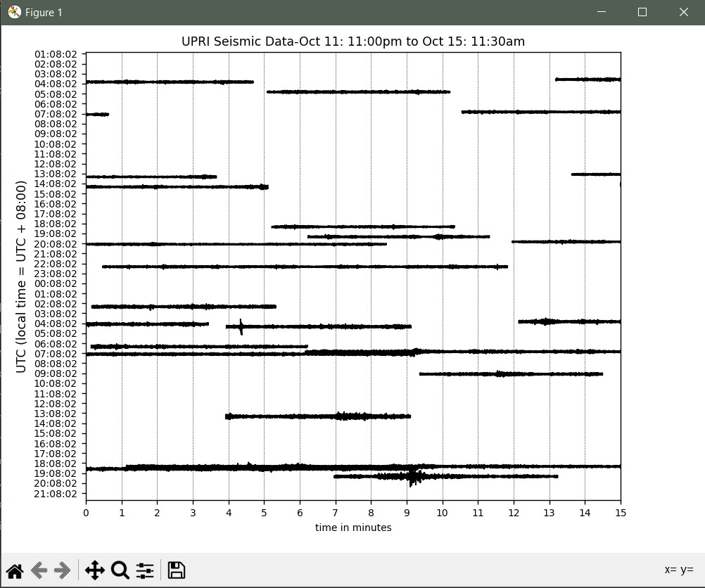

How to Use FDSNWS to Download Ground Motion Data and Station Metadata
===============================================

## Introduction
**FDSNWS** (Federation of Digital Seismograph Networks Web Services) is a set of web services that allow users to access and retrieve seismic data from various seismological networks and data centers. This documentation will guide you through the process of using FDSNWS to download ground motion data and its metadeta from the UPRI EarthquakeHub Network. Understanding the distinction among these two is essential to make interpretations more significant. In the context of FDSNWS,

- **Data:** This is the actual seismic information you’re interested in: the measurement of the ground motion either in displacement, velocity, or acceleration

- **Metadata:** This provides important details *about the station/s (seismic sensor) that records the data.* It includes information such as where the station is located, its frequency response, and other organizational information. Think of metadata as the digital *manual* of the seismic instrument.

## Service Overview

FDSNWS provides various services for accessing different products of a seismic network.The service used for ground motion data is the ```dataselect``` service. While the ```station``` service is used to obtain the metadata.

### DataSelect
This service  allows you to retrieve time series data from seismological instruments. In the context of seismology, time series data refers to recordings of ground motion or seismic activity ***over time.***

Here are the following data you can gather from ```dataselect``` service

1. ***Seismic Waves:*** From the dataselect service, you can fetch actual data about the movement of the Earth's surface during events like earthquakes. Think of this as a detailed record of how the ground shakes during such events.

2. ***Time Charts:*** You can request time charts that show you how this shaking changes over time. These charts help scientists and researchers analyze and study the seismic activity.

    More information about DataSelect service <a href="https://www.fdsn.org/webservices/fdsnws-dataselect-1.1.pdf" target="_blank">here</a>

### Station
This service provides a way to access and retrieve metadata about seismic monitoring stations.
Here are the following information you can gather from ```station``` service

1. ***Station Locations:*** You can find out where seismographic stations are located on the Earth's surface. This data is crucial for understanding which regions are being monitored for seismic activity.

2. ***Instrument Details:*** The service offers information about the instruments used at each station, most importantly, their frequency response. The frequency response is necessary for the digital processing of the instrument data.

3. ***Operational Status:*** You can learn whether a station is currently operational or if it's undergoing maintenance or repairs. This is essential for assessing the reliability of data from that station.

4. ***Data Availability:*** The service can inform you about the availability of data from specific stations. It lets you know if historical data is accessible or if data is currently being recorded.

5. ***Network Information:*** You can also obtain data about the seismographic networks to which these stations belong. This includes details about the organizations running the networks and their objectives.


## Obtaining the Data
### Steps to Download Ground Motion Data

To obtain the Ground Motion Data, we will be using the ```dataselect``` service.
1. Access the <a href="https://earthquake.science.upd.edu.ph/fdsnws/" target="_blank">UPRI Earthquake Hub SeisComP FDSNWS Web Service</a>

2. Choose the ```dataselect/``` web service


3. Proceed by choosing ```1/```



4. Under available URLs, select ```builder``` from the options to proceed to the URL Builder where you will input your information request.

Clicking ```builder``` redirects you to this page:


5. Specify the parameters of the data you want to download.
  This includes:

    - **Network and Station Information:**

        - ```network```:  Use this parameter to specify the network code, representing the seismological network you are interested in.
        - ```station```: Defines the station code, which identifies a specific seismic station.
        - ```location```: Specifies the location code, typically a two-character code representing the location of the instrument at the station.
        - ```channel```: Specifies the channel code, which identifies a specific data channel (e.g., "BHZ" for a broadband horizontal component).

      Here are some references for the Station Naming Convention:
      ```{seealso}
      - <a href="https://manual.raspberryshake.org/stationNamingConvention.html"> Raspberry Shake Station Naming Convention </a><
      - <a href="http://www.fdsn.org/pdf/SEEDManual_V2.4_Appendix-A.pdf" target="_blank"> SEEDManual: Channel Naming </a>
      ```


    - **Time Window:**

        - ```starttime```: Specifies the beginning time of the data you want to retrieve
        - ```endtime```: Specifies the end time of the data you want to retrieve

       ```{note}
        - The time is formatted **YYYY-MM-DDTHH-MM-SS**. The date and time are separated by the "T". The time is in 24-Hour (military time format).
        -  For example, we want to obtain the data starting from  ```October 11, 2023 at 11:30pm``` till ```October 12, 2023 11:30 am``` start time should be  ```2023-10-11T23:30:00``` and end time should be ```2023-10-12T11:30:00```

        ```

    - **Data Format:**
        - ```format```: Specifies the format in which you want to receive the data. The ground data is in **miniSEED** format.

    - **Data Availability and Quality**:
        - ```availability```: Allows you to filter data based on its availability (e.g., "available," "not available," "all").
        - ```quality```: Filters data based on its quality (e.g., "D," "M," "Q," "R").

    - **Data Limit:**
        -  ```limit```: Sets the maximum number of data segments to return in the search results. This parameter is useful for limiting the amount of data you receive in a single request.

    - Time Correction:
        - ```updatedAfter```: Specifies the last time the data was updated. It allows you to request data that has been updated or added after a certain timestamp.

    ```{seealso}
    Refer <a href="https://www.fdsn.org/webservices/fdsnws-dataselect-1.1.pdf" target="_blank">here</a> for the query guide.
    ```

    ```{admonition} Example
    The following parameters of our test network are the following:
    - Network: AM
    - Station: R3B2D
    - Location: 00
    - Channel: EHZ
    The values vary according the the network you want to extract data from.

    

    ```


6. After filling out the form, click the link to start downloading data through clicking the URL located at the bottom part of the page. Refer to the previous screenshot in Step 5.


### Steps to Download Station Metadata

To obtain the Metadata, we will be using the ```station``` service.

1. Access the <a href="https://earthquake.science.upd.edu.ph/fdsnws/" target="_blank">UPRI Earthquake Hub SeisComP FDSNWS Web Service</a>
2. Choose the ```station/``` web service
3. Proceed by choosing ```1/```


4. Under available URLs, select ```builder``` from the options to proceed to the URL Builder where you will input your information request.

Clicking ```builder``` redirects you to this page:



5. Specify the parameters of the data you want to download.
This includes:

    - **Time Constraints**:

        - ```starttime```: Specify the earliest time from which you want to retrieve station data.
        - ```endtime```: Specify the latest time up to which you want to retrieve station data.
        - ```startbefore```: Find stations that were operational before the provided start time.
        - ```startafter```: Find stations that became operational after the provided start time.
        - ```endbefore```: Find stations that were operational before the specified end time.
        - ```endafter```: Find stations that became operational after the specified end time.

         ```{note}
        Refer to the instructions above regarding time formatting.

        ```

    - **Channel Constraints**:

        - ```Network```: Filter stations by specifying their network code(s).
        - ```Station```: Narrow your search by station code(s) to retrieve specific stations.
        - ```Location```: Filter stations by location code(s), which can distinguish instruments at the same station.
        - ```Channel```:  Specify channel code(s) to retrieve specific seismographic channels.

    - **Geographic Constraints**:

        - ```None```: Retrieve stations without any specific geographic constraints.
        - ```Bounding Box```: Filter stations within a specified geographic rectangular area.
         - ```Circle```: Focus on stations located within a circular geographic region.

    - **Service Specific Constraints**:

       - ```Level```: Choose the level of detail for station information, with the default being “Station.” Various levels determines the amount of information included in the metadata, i.e. a level of *Response* would include the station frequency response, whereas a level of *Station* only includes organizational information about the station.
       - ```Exclude Restricted Channels```: Exclude stations with channels marked as restricted.
       -```Include Data Availability```: Include information about data availability at these stations.
       - ```Update After```: Filter stations updated after a specified time.

   - **Match Time Series Output Control**:

        - ```Format```: Specify the output format for station data, with the default being "FDSN Station XML."
        - ```Formatted```: Decide whether the output should be formatted or not for easier readability.
        - ```No Data 404```: Control the response behavior for missing data, allowing you to receive a 404 response for "no data."

    ```{seealso}
    Refer <a href="https://www.fdsn.org/webservices/fdsnws-station-1.1.pdf" target="_blank">here</a> for the query guide.
    ```


6. After filling out the form, click the link in the URL textbox you will be redirected to the raw Metadata.



7. To save the raw metadata, press `CTRL + s`. Save with your desired file name.


## Processing the Data

### From DataSelect Service:

To use fetched seismic data for plotting or analysis, you can use ObsPy.
 Follow these steps:

1. **Install ObsPy**
Make sure ObsPy is installed:

```
pip install obspy
```


2. **Import the necessary modules**
Create a Python file. You need to write a script that imports ObsPy modules for data processing and plotting:

```
from obspy import read
import matplotlib.pyplot as plt
```


3. **Load your seismic data**
You can use the obspy.read() function to load your existing seismic data file. ObsPy can read various formats, such as MiniSEED, SAC, and more. Here's an example of how to load a MiniSEED file:

```
st = read('your_seismic_data.mseed')
```

Replace 'your_seismic_data.mseed' with your actual file name.


 ```{admonition} Example
 From the retrieved data from date range ```2023-10-11T23:30:00``` and ```2023-10-12T11:30:00```, I've downloaded the MiniSeed data with the file name ```fdsnws.md```

```

```
st = read('fdsnws.mseed')
```


4. **Plot the time series**
You can use ObsPy to plot the loaded time series data using Matplotlib. Here's an example:

```
st.plot(type="dayplot", title="Seismic Data", vertical_scaling_range=2000, color="black", size=(800, 600))
plt.show()
```

The type="dayplot" argument specifies the type of plot you want to create. You can adjust the other parameters as needed, such as title, scaling range, color, and figure size.
More plot features accessible <a href="https://docs.obspy.org/packages/autogen/obspy.core.stream.Stream.plot.html" target="_blank">here</a> for the query guide.


Run your python code. If your code ran successfully, a pyplot window containing your visualized miniSEED data will appear.




5. **Save the plot file**
- Click the save icon in the lower part of the window to save the plot image.

Congratulations! You now have a plot of the Seismic Data you just downloaded from FDSNWS!

### From Station Service

1. **Install ObsPy**
if you haven't, install ObsPy:

```
pip install obspy
```


2. **Import the necessary modules**
Create a Python file. You need to write a script that imports ObsPy modules for data processing and plotting:

```
from obspy import read_inventory
```


3. **Load your Station Metadata**
You can use the obspy.read() function to load your existing seismic data file. ObsPy can read various formats, such as MiniSEED, SAC, and more. Here's an example of how to load a MiniSEED file:

```
inv = read_inventory("your_station_metadata.xml")
```

Replace 'your_seismic_data.mseed' with your actual file name.


 ```{admonition} Example
From the retrieved data from date range ```2023-10-11T23:30:00``` and ```2023-10-12T11:30:00```, I've downloaded the Station Metadata with the file name ```query.xml```

```

```
inv = read_inventory("query.xml")
```

4. **Print your Station Metadata**

```
print(inv)
```

Your source code should look like this:

```
from obspy import read_inventory
inv = read_inventory("your_station_metadata.xml")
print(inv)
```

A printed Station Metadata should look like this.


Reference for processing Station Metadata through ObsPy <a href="https://docs.obspy.org/packages/autogen/obspy.core.inventory.html" target="_blank">here</a>
