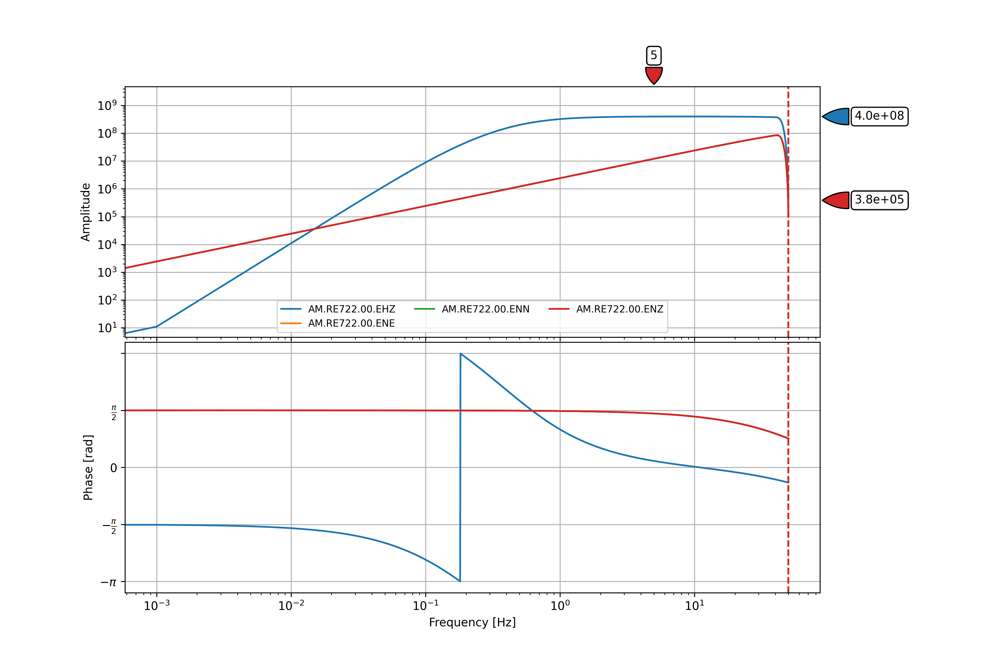

Programmatically Getting the Metadata
=======================================

```{note}
The “metadata” or “instrument response files” complement the raw waveform data, providing the information that seismologists use for data processing, including:
  - gains, overall sensitivity, poles, zeros and filters needed to deconvolve the data and arrive at true ground motion
  - latitude, longitude, elevation (which are obfuscated to ~1 km to protect user’s identities)instrument type
  - any and all changes over time (since May, 2019)
```

To get individual instrument-response-file using python:

1. Make sure you have `python` installed. To check if you have python properly installed, run this command in the terminal:
  ```bash
  python --version
  ```
  or
  ```bash
  python3 --version
  ```
  ```{note}
  If python is not installed yet, please refer to their [official site](https://www.python.org/downloads/) to get the installer depending on your machine.
  ```
2. Install the necessary python packages:
  ```bash
  pip install obspy matplotlib
  ```
3. Save the python script below into a file named `get_inst_resp_file.py`.
  ```python
  from obspy.clients.fdsn import Client
  from obspy import UTCDateTime
  import argparse

  def main(station_name):
    try:
      rs = Client('https://earthquake.science.upd.edu.ph')

      inv = rs.get_stations(network='AM', station=station_name, level='RESP')

      fig = inv.plot_response(0.001, station=station_name, show=False, time=UTCDateTime.now())

      # Save the instrument response plot into a PNG file
      fig.set_size_inches(12, 8)  # Set the output size
      fig.savefig(station_name + "_inst_resp_file.png", dpi=300) 

      # Save the instrument response information into an XML file
      inv.write(station_name + "_inst_resp_file.xml", format="STATIONXML")

      # Print a message indicating the successful retrieval and saving of the instrument response files
      print(f"[\033[92m OK \033[0m] ", end='')
      print(f"Instrument response files for station '{station_name}' have been successfully retrieved and saved")
      print(f"- PNG plot: {station_name}_inst_resp_plot.png")
      print(f"- XML metadata: {station_name}_inst_resp_file.xml")

  except Exception as e:
      # Handle any exceptions that occur during execution
      print(f"[\033[91m ERROR \033[0m] ", end='')
      print(f"{e}")


  parser = argparse.ArgumentParser(description="Retrieve and save instrument response files for a specified station.")
  parser.add_argument("station_name" , help="Name of the station you want to get the instrument response file of")
  args = parser.parse_args()
  main(args.station_name)
  ```
  ```{note}
  To get the instrument response file of other station, just  change the value of the `stn` variable to your desired station name.
  ```
4. Run the python script in terminal using the command below. Specify the name of the station you want to get the instrument response of by changing the <station_name> argument to the device’s station name. (Note: Only the station name is required. No need to specify the network name.)
  ```bash
  python3 get_inst_resp_file.py <station_name>
  # i.e. python3 get_inst_resp_file.py RE722
  ```
  After running the script, it will output a PNG file of the plot and an XML file of the instrument response information of the station specified in the script.
  

  ```{admonition} Sample Output  
  
  Sample instrument-response-file of RE722 station in PNG format.
  ```