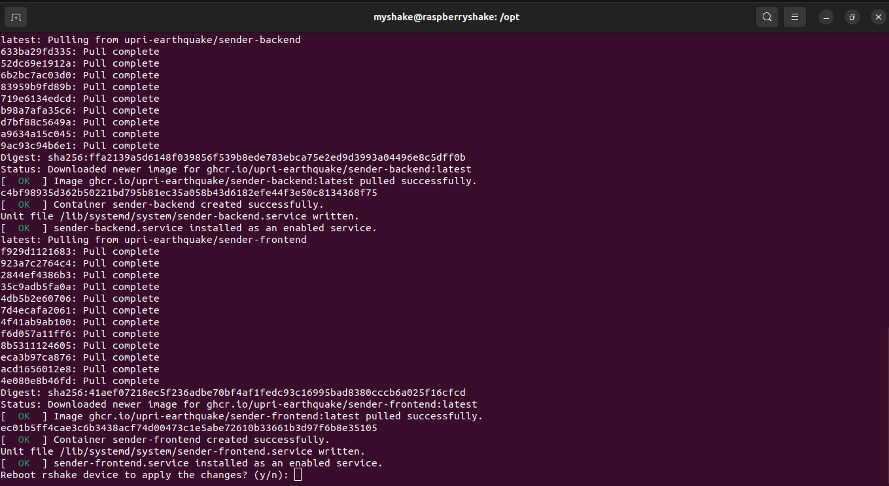

Installing EarthquakeHub Client on Raspberry Shake
======================================================

To enable your Raspberry Shake device to send data to the EarthquakeHub network, you need to install the EarthquakeHub client software. This guide will walk you through the installation process.

## 1. Connect to Your Device via SSH

Before you begin the installation, make sure you can access your Raspberry Shake device via SSH. If you're new to SSH, you can find instructions on how to connect in <a href="https://upri-earthquake.github.io/connect-to-rshake" target="_blank">this tutorial.</a>


## 2. Run the Installation Script

In your SSH terminal, execute the following command:

```bash
bash <(curl https://raw.githubusercontent.com/UPRI-earthquake/sender-backend/main/install.sh)
```


```{note}
 To uninstall, simply change the link above from ```".../install.sh"``` to ```".../uninstall.sh"```
```


The script will perform the installation. As it progresses, check that each status message displays **"OK"** instead of **"ERROR."** Once the installation is complete, you'll receive a prompt. Respond with "y" to initiate a restart of your Raspberry Shake device.


## 3. Access the EarthquakeHub Client

After about 5 minutes, your device will finish initialization. Open a web browser and enter the address <a href="https://rs.local:3000" target="_blank">rs.local:3000.</a>

You should see the EarthquakeHub client interface. Congratulations, you've successfully installed the client software!


Next, proceed to the <a href="https://upri-earthquake.github.io/sending-data-to-ehub-network.html" target="_blank">next tutorial</a> to learn how to send data to the EarthquakeHub network.
