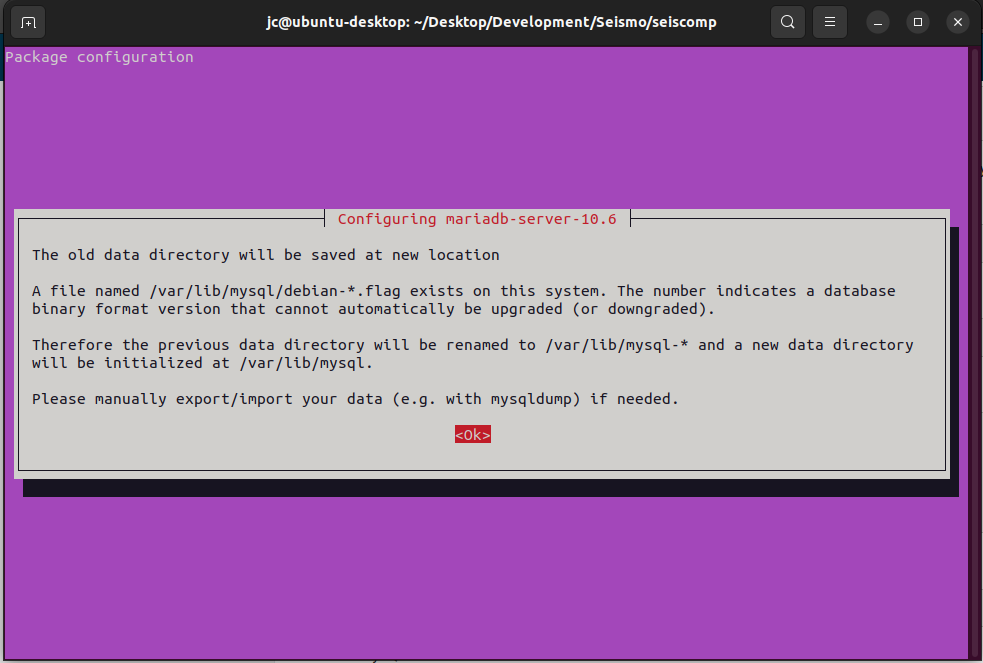

Introduction To SeisComp
========================

**SeisComp** is a seismological software that has been developed collaboratively by the GEOFON Program at Helmholtz Centre Potsdam GFZ German Research Centre for Geosciences and gempa GmbH. It plays a vital role in various aspects of seismological operations, encompassing data acquisition, processing, distribution, and interactive analysis.

While SeisComP is employed by the EarthquakeHub Network for processing seismic data sourced through citizen science efforts, it's important to note that its use is not an absolute requirement within the EarthquakeHub Network. Alternative data processing software capable of handling miniseed data can also be employed for processing network data.

SeisComP encompasses a suite of modular components, each dedicated to specific tasks, including:
1. **Global Parameters:** Unified schema for configuring each modules.
2. **Acquisition:** Responsible for data collection.
3. **Inventory:** Manages network information.
4. **Messaging:** Facilitates communication between system elements.
5. **Processing:** Executes advanced data analysis and interpretation.
6. **Utilities:** Offers various auxiliary tools for enhanced functionality.


## Installation from Pre-Compiled Release Package
This guide provides instructions for installing SeisComP packages on machines running Ubuntu. These guide works for Ubuntu 20.04 and 22.04, as of this writing. For more comprehensive installation details, please consult the <a href="https://www.seiscomp.de/doc/base/installation.html" target="_blank">official documentation.</a>


1. Begin by creating a directory where you intend to download and install SeisComP packages.
2. Navigate to the directory you've just created and download the appropriate SeisComP binary package compatible with your Linux distribution and architecture. You can obtain this package from the <a href="https://www.seiscomp.de/downloader/" target="_blank">SeisComP download site</a>.

3. Within the same directory, retrieve the SeisComP maps using the following command:
    ```bash
    wget "https://www.seiscomp.de/downloader/seiscomp-maps.tar.gz"
    ```
4. Unpack the `seiscomp*` files, which include the binary package, maps, and documentation:
    ```bash
    tar xzf seiscomp-4.0.0-ubuntu20.04-x86_64.tar.gz
    ```
    ```bash
    tar xzf seiscomp-maps.tar.gz
    ```
    ```bash
    tar xzf seiscomp-4.0.0-doc.tar.gz
    ```
    <div class="rst-content note">
      <p class="rst-content admonition-title">
        <b> NOTE </b>
      </p>
      <p>
    <body class="rst-content admonition">
    For some packages, documentations are already included in the downloaded seiscomp package so there is no need to download and unpack the documentation.
    </body>
      </p>
    </div>

    >
    You may check that all files are properly unpacked by running the `ls` command:
    ```bash
    ls seiscomp
    bin  etc  include  lib  man  sbin  share
    ```
5. Execute the following commands to install dependencies and set up the environment:

    ```bash
    ./seiscomp/bin/seiscomp install-deps base
    ```
    <div class="rst-content note">
      <p class="rst-content admonition-title">
        <b> NOTE </b>
      </p>
      <p>
    <body class="rst-content admonition">
   Depending on your Ubuntu version, additional steps may be required to address specific dependencies:
    </body>
  </p>
    </div>

    - On Ubuntu 18: Install Python and related libraries:
      ```bash
      sudo apt-get install python libqtgui4
      ```
    - On Ubuntu 20 and newer: Ensure libpython3-dev is installed:
      ```bash
      sudo apt-get install libpython3-dev
      ```
    - Alternatively, for Mint 18 (Ubuntu 16.04):
      ```bash
      sudo apt-get update
      sudo apt-get install libxml2 libboost-filesystem1.58.0 libboost-iostreams1.58.0 libboost-thread1.58.0 libboost-program-options1.58.0 libboost-regex1.58.0 libboost-signals1.58.0 libboost-system1.58.0 libssl1.0.0 libncurses5 libmysqlclient20 libpq5 libpython2.7 python-numpy mysql-server mysql-client libqtgui4 libqt4-xml libqt4-opengl libqt4-sql-sqlite
      ```
6. Configure the database. You may choose to use either MariaDB or a MySQL for the database.
    - For a MariaDB installation:
      ```bash
      ./seiscomp/bin/seiscomp install-deps mariadb-server
      ```
      
    - For a MySQL installation:
      ```bash
      ./seiscomp/bin/seiscomp install-deps mysql-server
      ```


## Getting Started

After installing seiscomp packages and configuring database, the next step is to setup seiscomp using
`seiscomp setup` or the wizard from within scconfig.
1. Execute setup via:

<div class="rst-content note">
    <p class="rst-content admonition-title">
        <b> NOTE </b>
    </p>
        <p>
          <body class="rst-content admonition"> In seiscomp setup default values are given in brackets []:
          </body>
        </p>
</div>

