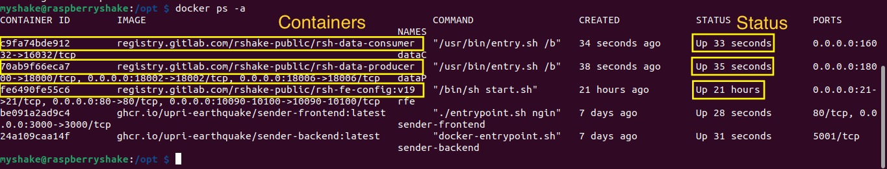
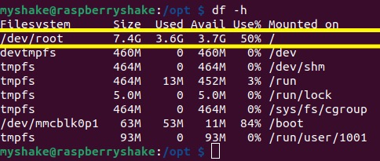

Blank rs.local Page Due to 100% Utilization of Device Storage
=======================================


A common cause for the rs.local webpage displaying a blank page is the full utilization of the storage (read-only memory) on rshake devices. This documentation specifically applies to rshake devices connected to the UPRI seismic network. Full storage utilization can lead to non-operational docker containers, which results in the rs.local webpage failing to load, as shown in the screenshot below.


## Investigation
If rs.local is showing a blank page, follow these steps to confirm if full utilization of device storage is indeed the problem:

1. **Access Your Raspberry Shake Device via SSH**
    - If you're unfamiliar with SSH (Secure Shell), refer to <a href="https://upri-earthquake.github.io/connect-to-rshake" target="_blank">this tutorial</a> for guide on connecting to your RShake device. 

2. **Check Docker Containers**
    - Run the command below to view all Docker containers along with their status and other pertinent information. Check if any of these three docker containers are not properly running `rsh-data-producer`, `rsh-data-consumer`, and `rsh-fe-config:v19`. If the status is not `Up ...`, proceed to the next check.
        ```bash
        docker ps -a
        ```
    - The output should look like this:
    

3. **Check Device Storage Utilization**
    - Execute the command below to check the storage utilization:
        ```bash
        df -h
        ```
    
    - The output of the command should look like the screenshot above. If the output shows 100% usage (Use%) on the /dev/root directory, it confirms that the device is not operating correctly due to full utilization of device storage.


## Resolution
If you confirm that the device storage is fully utilized, we need to reinstall the EarthquakeHub software packages to free up space it utilizes. Please follow the troubleshooting steps provided in the next section of this guide to address and resolve the issue.

1. **Uninstall the EarthquakeHub Software Packages**
    - Run the command below to the terminal to perform uninstallation:
        ```bash
        bash <(curl https://raw.githubusercontent.com/UPRI-earthquake/sender-backend/main/uninstall.sh)
        ```

2. **Restart the Device**
    - After successful uninstallation, reboot your RShake device to apply the changes:
        ```bash
        sudo reboot
        ```

    ```{note}
    After uninstalling the EarthquakeHub software packages, you need to reinstall the software packages again, then perform relinking of your device to your EarthquakeHub’s account and start streaming to the network again.
    ```

3. Reinstall the EarthquakeHub software packages by running this command:
    ```bash
    bash <(curl https://raw.githubusercontent.com/UPRI-earthquake/sender-backend/main/install.sh)
    ```
    ```{note}
    Refer to this [link](https://chrscbs.github.io/ehub_docu_ui_test/installing-rshake-client.html#run-the-installation-script) for installation of the software packages.
    ```

4. Link you device to your EarthquakeHub account to start streaming to the EarthquakeHub Network again.
    ```{note}
    Refer to this [link](https://upri-earthquake.github.io/sending-data-to-ehub-network.html#device-to-account-linking) to perform account linking and starting stream to the network.
    ```
