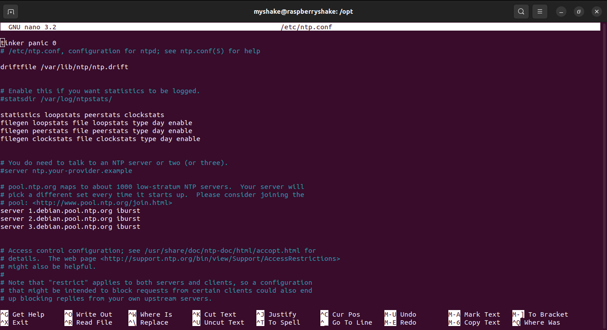
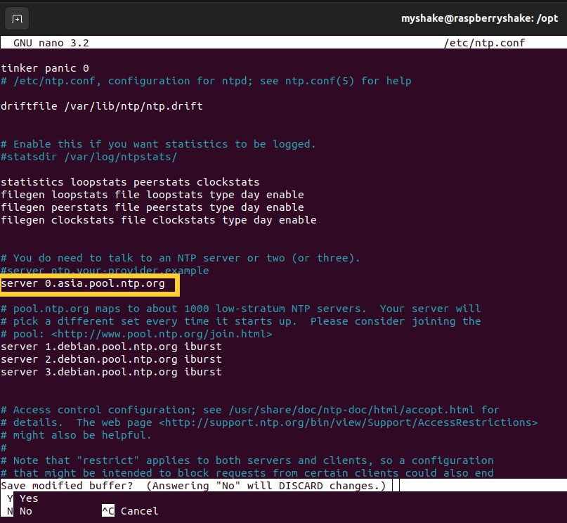

RShake NTP Timing Issue
=======================================


The issue of incorrect time in RShake devices can be resolved by addressing the NTP (Network Time Protocol) service. Follow these instructions to fix the issue:

1. **Access Your Raspberry Shake Device via SSH**
    - If you're unfamiliar with SSH (Secure Shell), refer to <a href="https://upri-earthquake.github.io/connect-to-rshake" target="_blank">this tutorial</a> for guidance on connecting to your RShake device. 

2. **Open the ntp.conf File**
    - Use the nano editor to open the ntp.conf file by executing the following command in the terminal:
        ```bash
        nano /etc/ntp.conf
        ```
    - The file should look like this:
        

3. **Add a New NTP Server**
    - Insert the following line into the file, just before the existing `server 1.debian.pool.ntp.org` line: 
        ```
        server 0.asia.pool.ntp.org
        ```
    - Your edited file should look like this:
        
    - After adding the line, save your changes to the file.

    ```{note}
    To save your your changes in nano editor press `Ctrl` + `X`. Then type `Y` when prompted to confirm your changes.
    ```

4. **Restart the Device**
    - Reboot your RShake device to apply the changes:
        ```bash
        sudo reboot
        ```

Following these steps should resolve the timing issue by ensuring the NTP service is correctly configured on your RShake device.