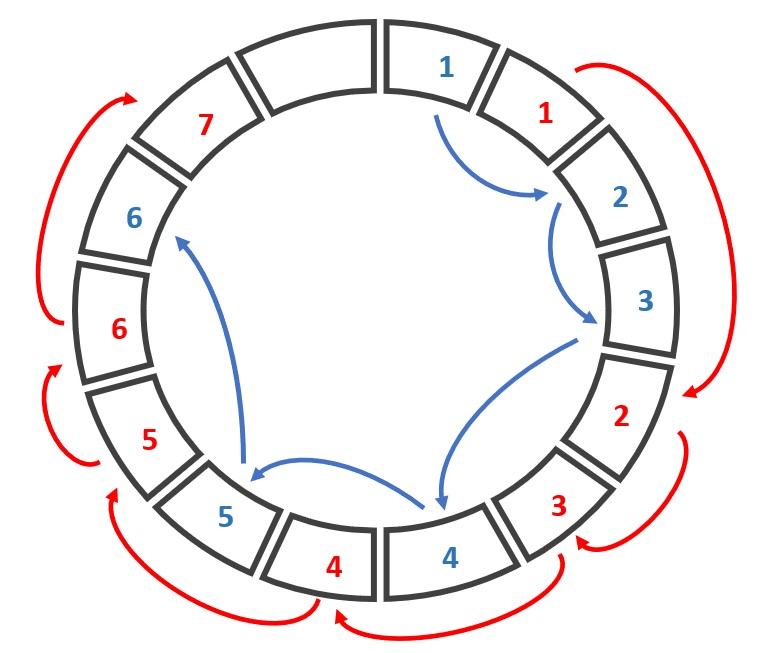
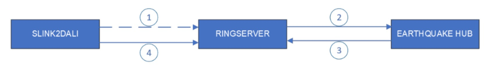
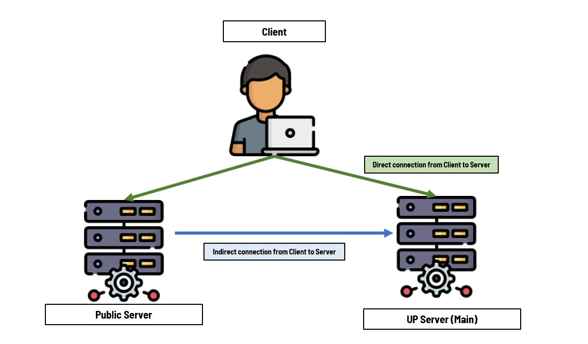

RingServer
=====================
This documentation aims to introduce the application of RingServer in the earthquake-hub citizen science network. See the <a href="https://upri-earthquake.github.io/system-overview" target="_blank">system overview here</a>. This is a fork of <a href="https://github.com/EarthScope/ringserver" target="_blank">EarthScope/RingServer</a>.See their <a href="https://github.com/EarthScope/ringserver/blob/main/doc/ringserver.md" target="_blank">original documentation here</a>.

## Background

There are various application-level communication protocols used in seismological data transmission, such are the SeedLink and DataLink protocols. The main goal of such protocols is to provide communication rules to transfer time series data from a source (such as file-archives or real-time digital sensors) towards a destination (such as a processing software or a data server).

The <a href="https://www.seiscomp.de/seiscomp3/doc/applications/seedlink.html" target="_blank">SeedLink</a> and <a href="https://seiscode.iris.washington.edu/svn/orb2ringserver/tags/release-1.0/libdali/doc/DataLink.protocol" target="_blank">DataLink</a> protocols both follow server-client paradigm. However there is a clear distinction in that the SeedLink protocol is a one-way stream communication from the server to the client. That is, the client initiates connection, requests a specific stream, and receives real-time or archived data stream. On the other hand, DataLink protocol can facilitate streaming of data from either direction: client to server, or server to client. That means, after initiating a connection, a client can negotiate a stream it wants, and either receive that data stream or send that data stream (given that this client has a source of data). (add connection diagram here for SeedLink and DataLink server, showing that a client in DataLink can be on both side, sender and receiver).

RingServer is one example of a server that utilizes the DataLink protocol as a server of time-series data. On the other hand, slink2dali and dalitool are examples of DataLink clients.

## What It Does

A RingServer utilizes a given communication protocol to take in time-series data, write it on a ring buffer, and serve that data (or diagnostics of such data) towards the clients. It can perform these via SeedLink, DataLink, or HTTP (WebSocket) protocols.

## How It Works
1. Running the program will start the main thread called ListenThread which listens on a socket waiting for a TCP client to connect.
2. Each new connection is handled on a new thread called ClientThread where the responses to the requests or commands from the client are handled mostly by that new thread. There are three types of clients, one for each protocol: DataLink, SeedLink, and HTTP.
3. In the case that a client sends a command to write a packet via the DataLink protocol, the execution will call `HandleWrite()` where the command message and the packet itself will undergo some checks before being written into the ring buffer via the `RingWrite()` function.

To have a better grasp of how this works, it’s important to understand the data structure used (ring buffer) and how it is used in this application.

In particular, the ring buffer is chosen as the data structure in which incoming packets are to be stored. In the context of our use case, it suffices to think of it simply as an array where the end wraps around to the beginning, creating a circular structure. This is such that when we write data into this array and reach the end, we then start overwriting what had been previously written on the beginning of the array.  This can be achieved via modulo addressing, meaning given an index value that is sequentially incremented to access the array values, when this value exceeds the length of the array, using modulo addressing would instead result for the index value to return to the beginning.

We can see how this results to a desirable property as a temporary receptacle (buffer) for non-stop data streams: the ring structure can be given a size that wouldn’t grow over time as we write more data due to the built-in feature of overwriting old data.




Lastly, this ring is treated as a shared memory between threads who write into and read from it. A connection from a client corresponds to a single thread, and a single thread can write multiple packets into the ring buffer. In particular, the data in the ring buffer is organized into streams, identified by a unique `streamid` with the format ```NET_STAT_LOC_CHANNEL```. Each stream represents a time-series data recording of a single axis of motion from a station belonging to a network. To represent a stream of data within the ring buffer, a linked-list data structure is used. Each value in the linked-list points to the location in the ring buffer where the next data point of that specific stream is stored.

## Changes
1. **Authorization**

    Being able to control which clients can connect to a server is a useful feature in server management. More so when you allow clients to write data into your server, it is necessary to discriminate among clients based on whether they have write permissions or not. Originally, RingServer can discriminate client connections via manually written IP addresses in the server configuration file (see original `TrustedIP` configuration on original documentation). However, in citizen science application, there is no way to identify user IP address pre-connection since IP addresses are often dynamic and hidden behind Network Address Translation (NAT).

    To solve this problem we used JSON web tokens (JWT) and an [external Authentication API](https://alyssapatricia.github.io/ui/ehub-backend/api-docs/), to identify whether a client requesting to write data into the RingServer has permission or not. The way this works is:

      a. We added the AUTHORIZATION command in the DataLink protocol, with the following format:

      ```bash
        AUTHORIZATION size\r\n [token]
      ```

       where token is a JWT of the client requesting WRITE permission, and size is the size of that token in bytes.

      b. This provided token is forwarded by the RingServer to the `AuthServer`. The value of this config variable should be set in `ring.conf` and should be given the HTTPS address of the Authentication API from which the client and the RingServer are registered in.

      c. In response, the AuthServer will handle the decoding and verification of the token, providing essential streamIDs and other relevant information associated with the token. Subsequently, the RingServer will designate the client connection as a write-authorized connection, specifically granting write permissions on the mentioned streamIDs.

      ```bash
        /* Response schema of AuthServer, received by RingServer */
        {
          status: responseCodes.INBEHALF_VERIFICATION_SUCCESS,
          message: 'Sensor is a valid streamer',
          sensorInfo: {
            username: decodedToken.username,
            role: decodedToken.role,
            streamIds: sensorStreamIds,   // based on username's registered WRITE permissions
            tokenExp: decodedToken.exp,
          }
        }
      ```

      d. Once authorized, the client gains the ability to successfully execute WRITE commands on the RingServer, specifically limited to the assigned streamIDs. In the event that the client lacks authorization, the connection will be closed. Additionally, if an authorized client attempts to write on streamIDs other than those with granted permissions, the RingServer will drop the packets.

      .

   This approach requires clients to register beforehand if they want to be allowed write access into the RingServer. Such is a service provided by the Authentication API (AuthServer) which can be run as an external HTTPS server that can provide tokens for any registered client and can verify tokens for any *registered* RingServer. In the context of the earthquake-hub citizen science network, UPRI is hosting this Authentication API.

   RingServer’s requesting token verification in behalf of a client should themselves also be registered through the Authentication API. This is done so as to maintain that all nodes (client or server) within the citizen science network are registered users that are all managed within the central Authentication Server.

2. **Redundant Connections**

   The dual nature of a DataLink connection allows for more complex network structures. Specifically in the citizen science network, a client can choose to send data to multiple publicly available RingServers which themselves can also forward their data to other RingServers. In such a scenario, a redundant connection is possible if a source of data establishes a direct and an indirect connection such as shown in the diagram:
   


   Such a redundant connection is actually tolerated so as to improve network data resiliency and to allow more localized event detection[^1]

   A problem that will arise from allowing redundant connections is that the RingServer at the last receiving end will receive packets from the same source once for every connection. Hence, it should be able to identify duplicate packets for a given stream and perform necessary action. In this case, we decided that it is simplest to just drop the packets (or not proceed on writing them into the ring and just move to the next available packet) so as to avoid having duplicate packets written on the ring.

   To do this, a function `CheckIfDuplicate()` was created to act as a filter on new packets, checking whether the packet is duplicate or not. This function is called before `RingWrite()`. The only basis used on deciding whether to write the new packet or not is by checking whether data *start-time of the packe*t  is later or equal to the *end-time of the latest written packet* in the stream that the packet belongs to.

   *(This is a very simplistic approach and might require further improvements if need be; however, this solution can be used in this application since a packet’s start-time and end-time both depends on the source data packet, i.e. a miniseed packet. That means that all packets coming from a single source and received on each different connection will have start and end times that are based on the same time source, meaning it is plausible to perform comparison between them and use this to decide time-ordering of the packets(footnote: one special case is that identical packets shall also have identical start and end times and hence can be concluded on the receiving end to be duplicates)*

   It should be mentioned that similar to the original RingServer, no packet re-ordering is performed in this fork. The packets that are coming are all received and written in the order they are received, with the difference that now we're dropping the packet if it fails the duplicate checking.


   [^1]: In the context of data processing softwares, a RingServer receiving data from a client geographically closer to it than another RingServer should be able to more quickly provide this data to a processor as compared to the other RingServer).

3. **Server-Sent-Events (SSE) Endpoints**

   Real-time monitoring of data and connection status is a useful feature in programs like the RingServer. The original implementation provided the `/streams` and `/connections` HTTP endpoints to serve stream data time ranges on the ring buffer and client connection diagnostics, respectively. These are available on a per-request basis, and hence if one wanted to perform real-time monitoring with these information, the simplest approach would be to perform polling on these endpoints.

   However, in our application, it is necessary that the consumer of these status updates should not be the one triggering these requests. Moreover, we require that this information be served in JSON format. To address these requirements, we have decided to implement Server-Sent Events (SSE) by adding additional endpoints, namely `/sse-streams` and `/sse-connections`. These endpoints will serve the required information in JSON format, and the RingServer will push updates to the clients at a fixed rate. SSE functions similarly to a WebSocket connection, but it differs in that it sends data only in one direction: from the server to the client.

   The following are example messages for each of the SSE endpoint.

    ```bash
    event: ringserver-streamids-status\n
    data:
    {
        "stream_ids": [
        {
            "stream_id":"AM_RE722_00_EHZ/MSEED",
            "earliest_data_start_time":"2023-06-27T11:30:51.183000Z",
            "latest_data_end_time":"2023-06-27T12:16:40.493000Z"
        },
        {
            "stream_id":"GE_TOLI2__BHE/MSEED",
            "earliest_data_start_time":"2023-05-30T11:21:37.069538Z",
            "latest_data_end_time":"2023-06-09T10:15:00.969538Z"
        }],
       "current_time": "2023-07-06 08:19:20.833048"
     }
     \n\n
    ```

    ```bash
    event: ringserver-connections-status\n
    data:
    {
        "connections": [
        {
            "protocol": "Unknown",
            "connection_time": "2023-07-06 08:19:20.733105",
            "hostname": "localhost",
            "username": "none",
            "role": "none",
            "num_rx_packets": "0",
            "rx_packets_per_sec": "0.0",
            "num_rx_bytes": "0",
            "rx_bytes_per_sec": "0.0",
            "lag_ms": "0.1",
            "stream_count": "0",
            "stream_ids": []
        },
        {
            "protocol": "DataLink",
            "connection_time": "2023-07-06 08:14:23.009189",
            "hostname": "localhost",
            "username": "citizen",
            "role": "sensor",
            "num_rx_packets": "206",
            "rx_packets_per_sec": "1.0",
            "num_rx_bytes": "105472",
            "rx_bytes_per_sec": "511.8",
            "lag_ms": "0.2",
            "stream_count": "16",
            "stream_ids": ["GE_TOLI2_.*/MSEED","AM_RE722_.*/MSEED"]
        }],
        "current_time": "2023-07-06 08:19:20.833048",
         "num_selected_connections": "5",
         "total_num_connections": "5"
    }
    \n\n
    ```

4. **Docker & Dependency Additions**

   The features added in this fork required additional dependencies, namely `jansson` and `curl`. We have opted to include these as built-in dependencies to simplify the process of building this forked version from source. This decision also makes it easier to build it into a docker image, which is particularly beneficial for our application, as we utilize Docker Compose for both development and deployment of our microservices.


## CONTRIBUTING.md
This is the link for [CONTRIBUTING.md](https://github.com/UPRI-earthquake/receiver-ringserver/blob/dev/CONTRIBUTING.md)
