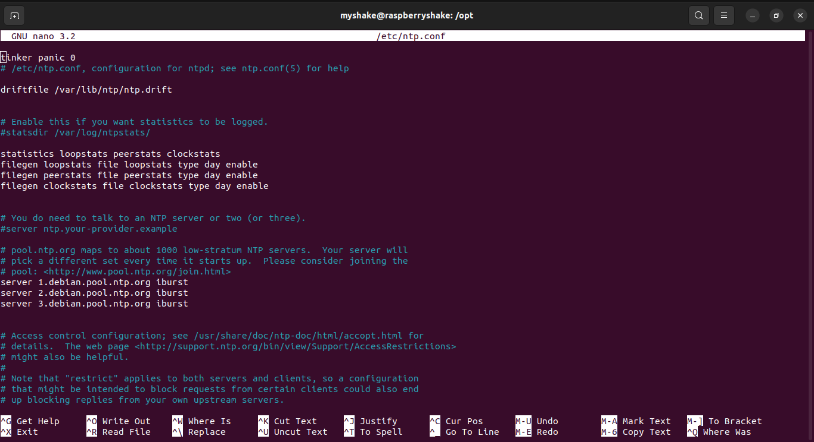
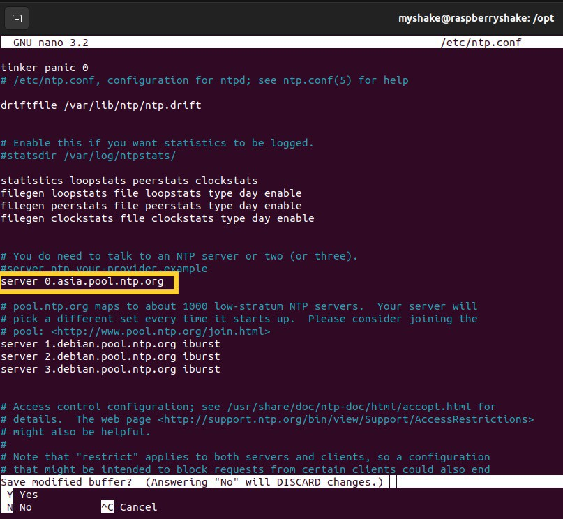

RShake NTP Timing Issue
=======================================

The issue of incorrect time in RShake devices can be resolved by addressing the NTP (Network Time Protocol) service. Follow these instructions to rectify the problem:


1. Access Your Raspberry Shake Device via SSH:
  - If you're unfamiliar with SSH (Secure Shell), refer to this tutorial for guidance on connecting to your RShake device. <a href="https://upri-earthquake.github.io/connect-to-rshake" target="_blank">this tutorial.</a>

2. Open the ntp.conf File: 
  Use the nano editor to open the ntp.conf file by executing the following command in the terminal:
    ```bash
    nano /etc/ntp.conf
    ```
  The file should look like this:
  

3. Add a New NTP Server:
  Insert the following line into the file, just before the existing `server 1.debian.pool.ntp.org` line: 
    ```
    server 0.asia.pool.ntp.org
    ```
  - Your edited file should look like this:
  
  - After adding the line, save your changes to the file.
  ```{note}
  To save your your changes to the file press `Ctrl` + `X`. Then type `Y` when prompted to confirm your changes.
  ```

4. Restart the Device:
  - Reboot your RShake device to apply the changes:
    ```bash
    sudo reboot
    ```

Following these steps should resolve the timing issue by ensuring the NTP service is correctly configured on your RShake device.