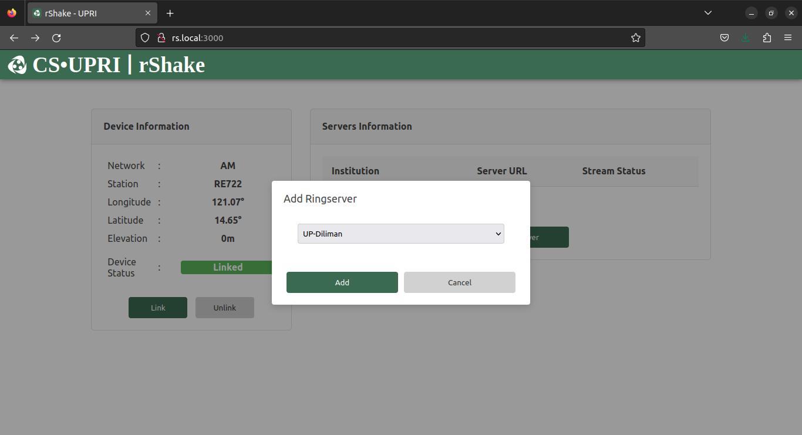

Sending Data to EarthquakeHub Network
=======================================

For a citizen scientist to contribute their real-time Raspberry Shake data to the EarthquakeHub network, here are the steps to follow:

> **_NOTE:_**  Make sure that you have already [installed the EarthquakeHub client on your Raspberry Shake device](https://alyssapatricia.github.io/ui/installing-rshake-client.html) before following this tutorial.

## 1. Register a `citizen` Account
   

   To register an account go to [earthquake-hub web app](https://earthquake.science.upd.edu.ph) and click the `Sign Up` button. Choose `citizen` as your Role, and provide the following required details:
     - A valid email address
     - Account password

------

## 2. Device to Account Linking
   

   In order for your device to stream data to the network, you should first link your device into your account.  This step will be done via the EarthquakeHub rShake client accessible via [rs.local:3000](http://rs.local:3000). To link your device, just click the `Link` button and input the account credentials you registered in Step 1, and the location information of your device:

    - Elevation (in meters)
    - Longitute (in degree coordinates)
    - Latitude (in degree coordinate)

    > You may use [Google Maps](https://google.com/maps) to search your location on the map. Get the latitude and longitude coordinates by right clicking your pinned location on the map. 
-----

## 3. Adding a Host
      

   After having linked your device, you are now ready to send data to any available server on the network. This step will also be done via the [EarthquakeHub rShake client](http://rs.local:3000). To do this, click `Add Server` and choose your target ringserver  input the following details of the host you want to send your Raspberry Shake data to:
     - Target ringserver's url
     - Hostname of the ringserver

