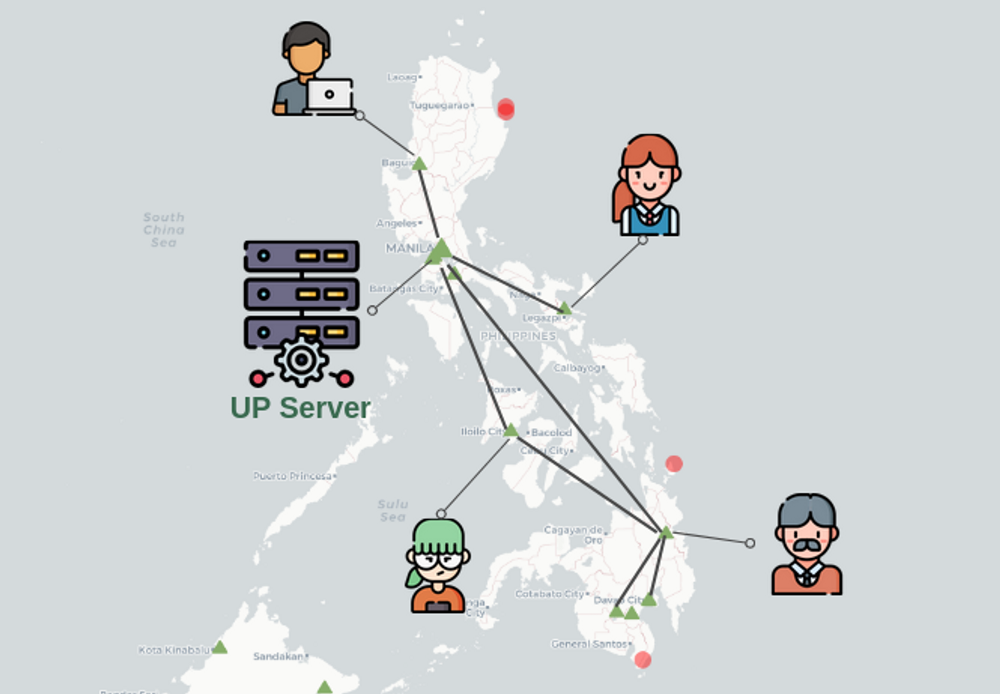

System Overview
=================================================================

### Real-Time Sensor Data Collection and Processing

The EarthquakeHub software suite enables a network of Raspberry Pi devices deployed across the entire country to transmit real-time sensor data to a central server. The central server processes and serves the received data for various purposes, including data archiving, earthquake detection, and public showcasing through the web application, <a href="http://earthquake.science.upd.edu.ph" target="_blank">earthquake.science.upd.edu.ph</a>,

The foundation of the system is built on a server-client model, where the client initiates a TCP connection to the central server and sends real-time sensor data over this connection.

The client devices used in this network are called <a href="https://raspberryshake.org/about/technology/" target="_blank">Raspberry Shakes</a>, which are Raspberry Pi computers equipped with ground motion sensors and a SeedLink server. On these devices we install the sender software (sender-frontend, sender-backend, and slink2dali) that facilitates the real-time transmission of locally acquired sensor data to our central server over the internet.

The central server employs a modified version of RingServer software to act as the receiver of all data sent by the client devices. The DataLink protocol is used as the communication protocol between slink2dali and the RingServer software that each runs on the client and the server, respectively. Once data is received, various software components, such as SeisComP and the EarthquakeHub web application, can access the locally available data for further processing.

Specifically, the server is equipped with SeisComP which utilizes collected data for real-time earthquake detection, monitoring, and data archiving. On the other hand, the web application EarthquakeHub serves as the public interface for the network, providing real-time information about seismic events, sensor data visualization, and access to the data archive.

Finally, to ensure the authenticity and integrity of the transmitted data, an authentication server is also integrated into the backend of EarthquakeHub. This enables the server to only allow registered and authorized citizen scientists to contribute data to the network. This measure safeguards the network's data quality and enhances its reliability.
